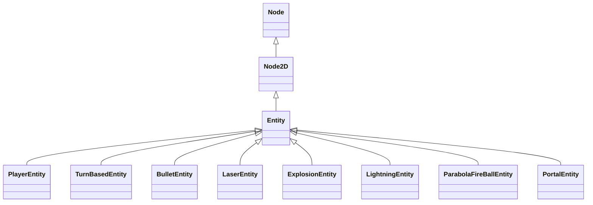

# Entity System 实体系统总览

## 概述
采用组合模式（Composition Pattern）来构建游戏对象。每个 Entity 由多个独立的、可重用的 Component 组成，每个 Component 负责实现特定的行为或功能。

**设计理念：** Entity 是"脚手架"，Component 做实际的工作（游戏逻辑）

## 🏗️ 系统架构

### 核心概念
- **Entity（实体）** - 游戏中的角色或对象，由多个 Component 组成
- **Component（组件）** - 独立的行为模块，提供特定功能
- **组合模式** - 通过组合而非继承来实现复杂行为

### 继承关系


## 🎯 主要特性

### 核心功能
- 🔧 **组件管理** - 自动注册、查找和管理组件
- 🎮 **行为组合** - 通过组合不同组件实现复杂行为
- ⚡ **性能优化** - 组件字典快速查找，避免运行时搜索
- 🛡️ **生命周期管理** - 完整的创建、更新、销毁流程
- 🧹 **内存管理** - 自动清理和资源释放
- 📊 **调试支持** - 完整的日志和调试系统

### 设计优势
- **模块化** - 每个组件独立，易于测试和维护
- **可重用** - 组件可以在不同实体间复用
- **可扩展** - 新功能通过添加组件实现
- **解耦合** - 组件间通过信号和接口通信
- **类型安全** - 强类型组件系统

## 📁 目录结构

```
Entities/
├── Entity.gd                    # 核心实体基类
├── Entity.tscn                  # 基础实体场景
├── Characters/                  # 角色实体
│   └── PlayerEntity.gd         # 玩家实体
├── Objects/                     # 游戏对象实体
│   ├── BulletEntity.gd         # 子弹实体
│   ├── LaserEntity.gd          # 激光实体
│   ├── ExplosionEntity.gd      # 爆炸实体
│   ├── LightningEntity.gd      # 闪电实体
│   ├── ParabolaFireBallEntity.gd # 抛物线火球实体
│   └── PortalEntity.tscn       # 传送门实体
```

## 🔧 核心组件

### Entity.gd - 实体基类
- **组件管理** - 自动注册和查找组件
- **生命周期** - 完整的创建、更新、销毁流程
- **节点查找** - 智能查找子节点和组件
- **调试支持** - 完整的日志系统

📖 **详细文档：** [Entity API 文档](Entities/Entity.md)

### 实体类型

#### 角色实体 (Characters/)
- **PlayerEntity** - 玩家实体，包含基础玩家功能
  📖 **详细文档：** [PlayerEntity API 文档](Entities/PlayerEntity.md)

#### 游戏对象实体 (Objects/)
- **BulletEntity** - 子弹实体，用于射击系统
- **LaserEntity** - 激光实体，直线攻击
- **ExplosionEntity** - 爆炸实体，爆炸效果
- **LightningEntity** - 闪电实体，链式攻击
- **ParabolaFireBallEntity** - 抛物线火球实体
- **PortalEntity** - 传送门实体

📖 **详细文档：** [Game Objects 文档](Entities/Game-Objects.md)

#### 回合制实体 (TurnBased/)
- **TurnBasedEntity** - 回合制实体基类
  📖 **详细文档：** [TurnBasedEntity API 文档](Entities/TurnBasedEntity.md)
- **TurnBasedPlayerEntity** - 回合制玩家实体

📖 **模板文档：** [Entity Templates 文档](Entities/Entity-Templates.md)

## 🎮 使用模式

### 创建实体
```gdscript
# 创建基础实体
var entity = Entity.new()

# 添加组件
entity.addComponent(HealthComponent.new())
entity.addComponent(MovementComponent.new())
entity.addComponent(InputComponent.new())
```

### 组件管理
```gdscript
# 获取组件
var healthComponent = entity.getComponent(HealthComponent)

# 检查组件存在
if entity.hasComponent(HealthComponent):
    print("Entity has health component")

# 移除组件
entity.removeComponent(HealthComponent)
```

### 节点查找
```gdscript
# 查找精灵节点
var sprite = entity.getSprite()

# 查找区域节点
var area = entity.getArea()

# 查找角色体节点
var body = entity.getBody()
```

## 🔄 生命周期

### 创建阶段
1. **实例化** - 创建 Entity 节点
2. **组件添加** - 添加所需组件
3. **场景树加入** - 添加到场景树
4. **信号连接** - 连接组件信号
5. **初始化** - 组件初始化

### 运行阶段
1. **组件更新** - 各组件独立更新
2. **交互处理** - 处理输入和交互
3. **状态同步** - 同步组件状态
4. **渲染更新** - 更新视觉效果

### 销毁阶段
1. **清理信号** - 断开信号连接
2. **组件移除** - 移除所有组件
3. **资源释放** - 释放占用的资源
4. **节点移除** - 从场景树移除

## 📊 性能优化

### 组件查找优化
- **字典查找** - 使用 `components` 字典快速查找
- **类型缓存** - 缓存组件类型避免重复查找
- **懒加载** - 按需初始化组件

### 内存管理
- **自动清理** - 组件自动注册和注销
- **资源释放** - 实体销毁时自动释放资源
- **引用管理** - 避免循环引用

### 更新优化
- **帧级控制** - `callOnceThisFrame` 避免重复调用
- **条件更新** - 只在需要时更新组件
- **批量操作** - 批量添加和移除组件

## 🛠️ 调试支持

### 日志系统
- **分级日志** - `printLog`, `printDebug`, `printWarning`, `printError`
- **条件输出** - 根据 `isLoggingEnabled` 和 `debugMode` 控制输出
- **详细信息** - 包含实体名称和类型信息

### 调试工具
- **组件状态** - 查看组件注册状态
- **节点树** - 查看实体节点结构
- **性能监控** - 监控组件更新性能

## 📚 最佳实践

### 组件设计
1. **单一职责** - 每个组件只负责一个功能
2. **独立测试** - 组件可以独立测试
3. **信号通信** - 组件间通过信号通信
4. **类型安全** - 使用强类型组件

### 实体设计
1. **组合优先** - 优先使用组合而非继承
2. **组件复用** - 在不同实体间复用组件
3. **依赖管理** - 正确处理组件依赖关系
4. **生命周期** - 正确处理实体生命周期

### 性能考虑
1. **组件数量** - 控制单个实体的组件数量
2. **更新频率** - 合理设置组件更新频率
3. **内存使用** - 注意内存使用和释放
4. **查找优化** - 使用高效的组件查找方式

## 🔗 相关系统

- **Component System** - 组件系统
- **Scene Management** - 场景管理
- **Debug System** - 调试系统
- **Signal System** - 信号系统

## 📚 完整文档

### 快速导航
- 🏠 [Components 总览](../Components-Overview.md) - 组件系统文档
- 📋 [Entity Templates](../Templates/Entities/) - 实体模板目录 